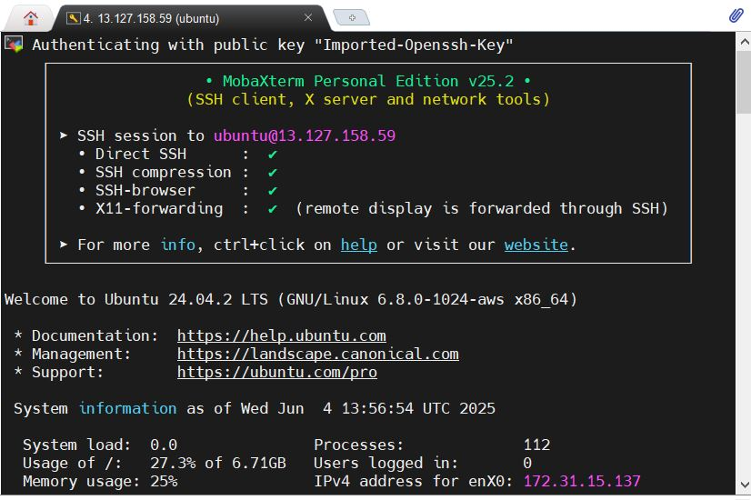

# 🔐 Connecting to EC2 Instances using MobaXterm (SSH)

This document explains how to connect to an AWS EC2 instance using MobaXterm and how to close the SSH session properly.

---

## ✅ Prerequisites

| Item                 | Details                                                  |
|----------------------|----------------------------------------------------------|
| Instance Name        | TEST Instance                                            |
| Public IP Address    | 3.110.168.78                                             |
| Username             | ubuntu (for Ubuntu AMI)                                  |
| Key Pair Name        | TEST 01                                                  |
| Key File             | TEST01.pem (downloaded during instance creation)         |
| AMI Used             | Ubuntu 24.04 (AMI ID: ami-0e35ddab05955cf57)             |
| Instance Type        | t2.micro                                                 |

---

## 🛠️ Connecting via MobaXterm (Step-by-Step)

1. **Open MobaXterm**
   - Launch the MobaXterm application.

2. **Create a New SSH Session**
   - Click **"Session"** in the top left corner.
   - Choose **"SSH"** as the session type.

3. **Enter SSH Connection Details**
   - **Remote host**: `3.110.168.78` (your instance's public IP)
   - **Specify username**: `ubuntu` (for Ubuntu AMIs)
   - Go to **"Advanced SSH settings"** tab:
     - Enable **"Use private key"**
     - Browse and select your `.pem` file (e.g., `TEST01.pem`)

4. **Save and Connect**
   - Optionally name and save the session.
   - Click **"OK"** to connect.

### 🖼️ Example SSH Connection Screenshot



---

## 🚫 Common Errors and Fixes

### ❌ *“Server refused our key” or “No supported authentication methods available”*
- Use the correct `.pem` file.
- Ensure key file permissions are correct:
  ```bash
  chmod 400 TEST01.pem
  ```
- Make sure you're connecting with the right **username**:
  - `ubuntu` for Ubuntu AMI
  - `ec2-user` for Amazon Linux

---

## ✅ Closing the SSH Session

### 🟢 Option 1: Using Terminal
Inside the session window, type:
```bash
exit
```
Press Enter — this logs you out and closes the connection.

### 🟢 Option 2: Using MobaXterm UI
- Click the **`X`** on the SSH tab in MobaXterm to close the session window.

> ⚠️ It’s best practice to type `exit` before closing to avoid hanging sessions.

---

## 📝 Notes

- Always secure your private key. Never commit `.pem` files to GitHub.
- You can create separate sessions for different instances in MobaXterm for easy access.
- If connecting fails, double-check the **Security Group rules**:
  - Allow SSH (port 22) from your IP.

---

## 🔗 References

- [AWS EC2 Connect Documentation](https://docs.aws.amazon.com/AWSEC2/latest/UserGuide/AccessingInstancesLinux.html)
- [MobaXterm Official Site](https://mobaxterm.mobatek.net/)
