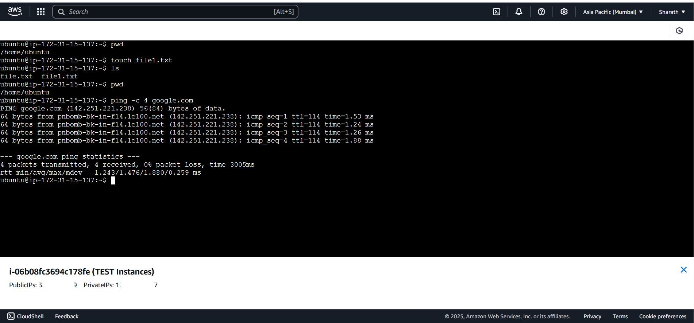

# 📘 AWS CLI + EC2 SSH Access Full Guide

This guide provides a step-by-step walkthrough to install and configure AWS CLI on Windows, create an EC2 instance, and connect to it using both the AWS Console UI and Windows Terminal (CLI).

---

## 📂 Guide Summary

| Section                        | Description                                           |
|-------------------------------|-------------------------------------------------------|
| AWS CLI Setup                 | Install and configure the CLI with Access/Secret Key |
| EC2 Instance Creation         | Launch a test EC2 instance (Ubuntu) from the console |
| SSH from Console              | Connect using EC2 Instance Connect (browser)         |
| SSH from Windows Terminal     | Connect from your local machine CLI using `.pem`     |
| Troubleshooting & Screenshots | Common fixes and connection screenshots              |

---

## 🔧 AWS CLI Setup

### 1. Install AWS CLI on Windows

- Download: [Install AWS CLI on Windows](https://docs.aws.amazon.com/cli/latest/userguide/getting-started-install.html)
- Run the `.exe` installer

### 2. Verify Installation

```bash
aws --version
```

### 3. Configure AWS CLI

Run:

```bash
aws configure
```

Enter your credentials:

```
AWS Access Key ID [None]: <your-access-key-id>
AWS Secret Access Key [None]: <your-secret-access-key>
Default region name [None]: ap-south-1
Default output format [None]: json
```

---

## ✅ Verify Configuration

To confirm credentials are working:

```bash
aws sts get-caller-identity
```

Expected output:

```json
{
  "UserId": "AIDAEXAMPLE",
  "Account": "123456789012",
  "Arn": "arn:aws:iam::123456789012:user/your-iam-user"
}
```

---

## 💻 EC2 Instance Creation

### Instance Configuration

| Parameter          | Value                                                        |
|--------------------|--------------------------------------------------------------|
| **Instance Name**  | TEST Instance                                                |
| **AMI Name**       | Ubuntu 22.04 LTS                                             |
| **AMI ID**         | (Choose region-based official image)                         |
| **Instance Type**  | t2.micro (Free Tier)                                         |
| **Key Pair Name**  | TEST01                                                       |

### Launch Steps

1. Go to EC2 Dashboard → Launch Instance
2. Fill in:
   - Instance name
   - AMI: Ubuntu
   - Instance type: `t2.micro`
   - Key pair: Create new → Download `.pem`
   - Security Group: Allow SSH (port 22)
3. Launch instance

---

## 🖥️ Connect to EC2 Using AWS Console UI

1. Go to **EC2 > Instances > Select Instance**
2. Click **Connect**
3. Choose **EC2 Instance Connect**
4. Click **Connect** (opens in browser)

### 📸 Screenshot: EC2 Instance Connect via Console UI
  


---


## 💻 Connect to EC2 from Windows Terminal

1. Move `.pem` file to a known folder (e.g., `D:\AWS\keys\`)
2. Open Windows Terminal or PowerShell
3. Set Permissions (Important!):

```bash
icacls "D:\AWS\keys\TEST01.pem" /inheritance:r
icacls "D:\AWS\keys\TEST01.pem" /grant:r "%username%:R"
```
---

## Manual `.pem` Permission Fix (Windows GUI Method)

If you're using Windows and can't run `chmod 400` (which is for Linux/macOS), you can manually set the correct `.pem` file permissions through File Explorer.

This method is required to ensure the `.pem` file is readable only by you — just like how Linux restricts it with `chmod 400`.

---

### Step-by-Step (Windows GUI)

> Example `.pem` file path: `D:\AWS\keys\TEST01.pem`

1. **Locate the `.pem` file** in File Explorer  
   Navigate to the folder containing your `.pem` key file (e.g., `D:\AWS\keys\TEST01.pem`)

2. **Right-click** on the file → select **Properties**

3. Go to the **Security** tab

4. Click on **Advanced**

5. In the new "Advanced Security Settings" window:
   - Click **Disable inheritance**
   - In the prompt that appears, choose:  
     **Remove all inherited permissions from this object**

6. Now, click **Add**

7. Click **Select a principal**

8. In the box, type **your Windows username**  
   - Then click **Check Names**  
   - It should underline or autocomplete — click **OK**

9. On the next screen, **check only** the **Read** permission  
   - Click **OK**

10. Click **Apply** → **OK** → **OK**  
    Exit all windows after saving changes

---

### What This Does

These steps ensure:

- No other user/group has access to the `.pem` file
- Only your Windows user has **read-only** access

This is equivalent to running the following in a Linux/macOS terminal:

```bash
chmod 400 your-key.pem
```
---

4. Connect via SSH:

```bash
ssh -i "D:\AWS\keys\TEST01.pem" ubuntu@<your-ec2-public-ip>
```
---

### 📸 Screenshot: Verified AWS Configure & EC2 SSH Connection

Below is a screenshot showing a successful AWS CLI configuration and EC2 SSH login from Windows Terminal:


---

## 🐞 Common Errors & Fixes

| Issue                                          | Fix                                                                                           |
|-----------------------------------------------|-----------------------------------------------------------------------------------------------|
| ❌ **Bad permissions on `.pem` file (Windows)** | Use `icacls` to remove inheritance and apply read-only permission:<br>`icacls "D:\AWS\keys\TEST01.pem" /inheritance:r`<br>`icacls "D:\AWS\keys\TEST01.pem" /grant:r "%username%:R"` |
| 🪟 **Can't use `chmod 400` on Windows**         | Use **GUI method**: Right-click `.pem` → Properties → Security → Advanced → Disable inheritance → Remove all permissions → Add only your user with **Read** permission |
| ❌ **Permission denied (publickey)**            | Make sure:<br>- You are using the correct SSH username (`ubuntu` for Ubuntu)<br>- `.pem` file is correctly configured and in the correct path<br>- Permissions are set using CLI or GUI method |
| 🔍 **Wrong or missing `.pem` path**             | Double-check the `.pem` file path in the SSH command — Windows paths need correct escaping and quotes |
| 🧭 **AWS CLI not recognized in Windows terminal** | Ensure AWS CLI was installed properly. Try reopening the terminal or restart the system if not detected |
| 🔐 **Configured CLI but unsure if it’s working** | Run `aws sts get-caller-identity` to verify if AWS CLI credentials are active and working |
| 🌐 **EC2 connection timeout / can't SSH**       | Check if:<br>- The EC2 instance is in **Running** state<br>- Security Group allows **inbound port 22 (SSH)** for your IP address |
| 📂 **Misplaced `.pem` file**                    | Move your `.pem` file to a known safe path like `D:\AWS\keys\`, then update your SSH command accordingly |


---

## 📸 Screenshots

Here are some key screenshots of the process:

```markdown


```

---


---

## 📘 References

- [AWS CLI Docs](https://docs.aws.amazon.com/cli/)
- [EC2 Access Guide](https://docs.aws.amazon.com/AWSEC2/latest/UserGuide/AccessingInstancesLinux.html)
- 🎥 [YouTube: EC2 + SSH Full Walkthrough](https://www.youtube.com/watch?v=cN4pt5KQ9eA&t=799s)

---

## 🧠 Tips

- Use IAM user with limited scope access for security
- Never expose or upload `.pem` or access keys publicly
- Document CLI activities in a `log.md` or `notes.md` for future learning
