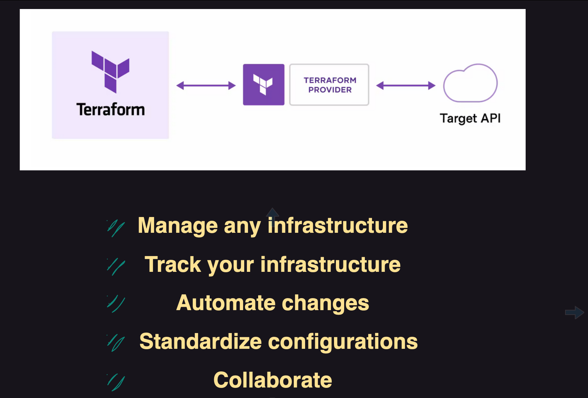
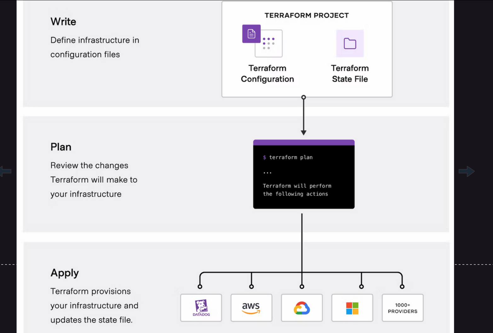
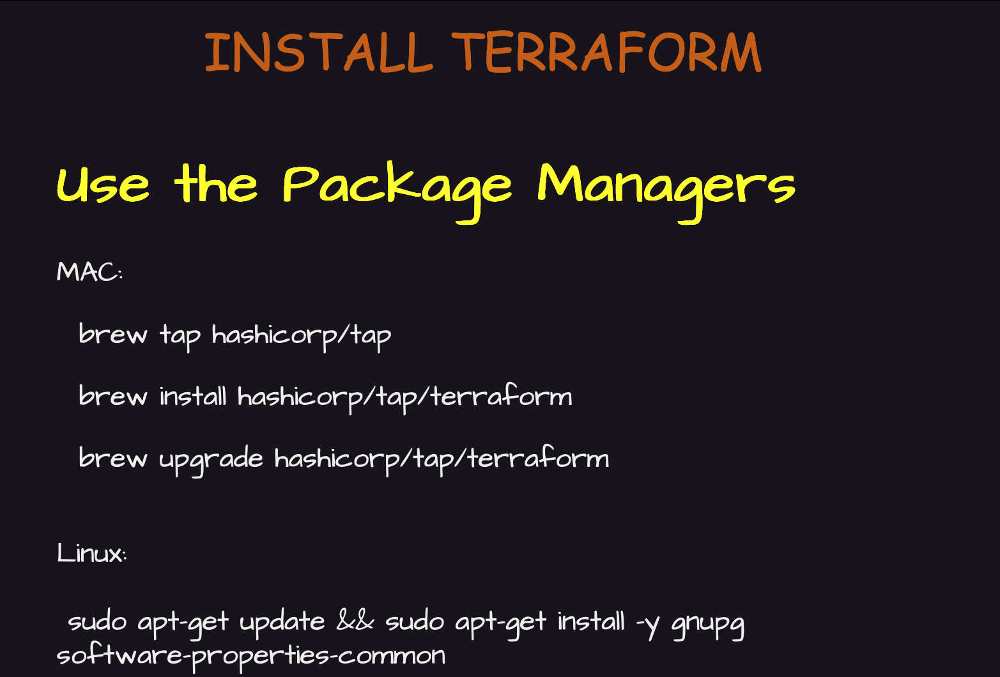
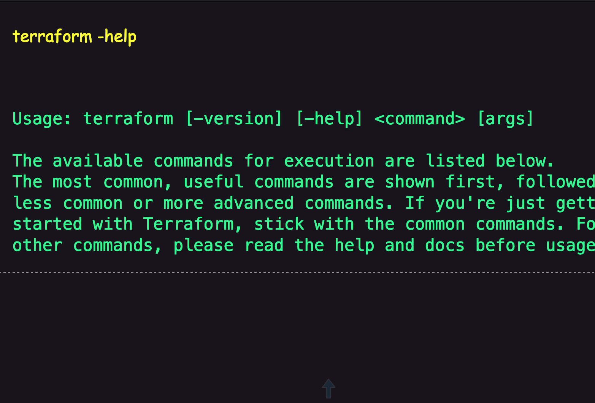
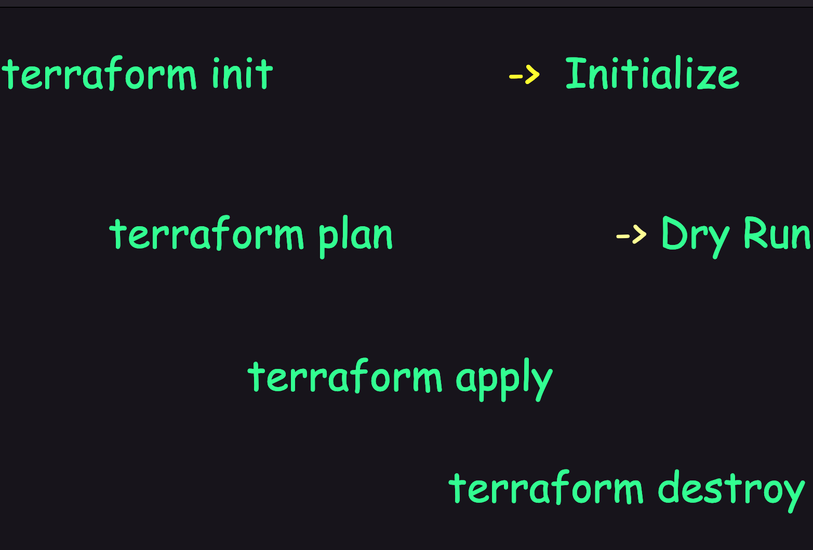
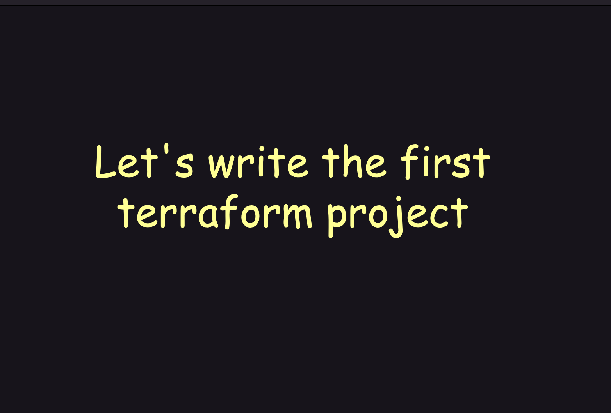
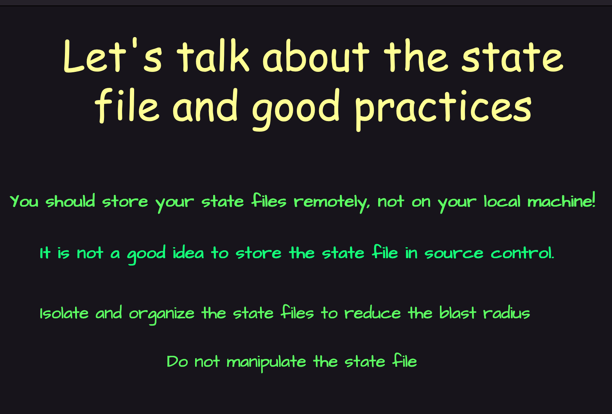
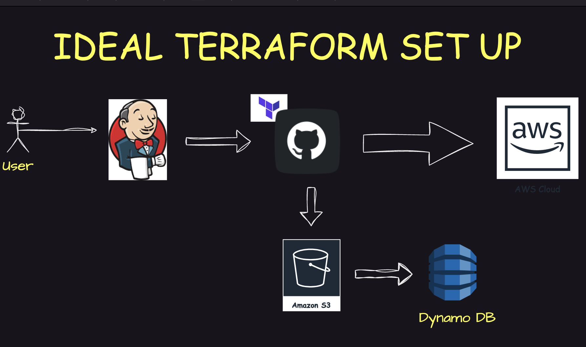
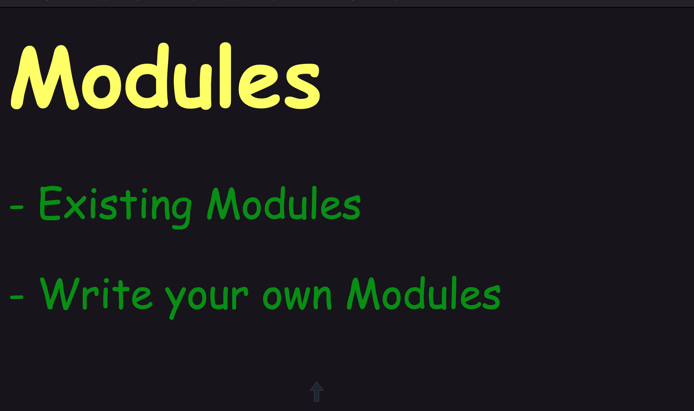
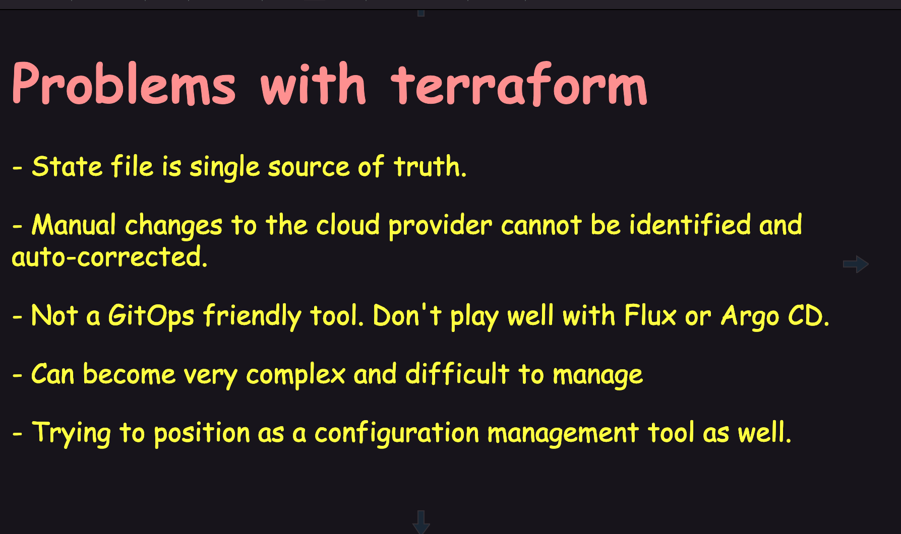

# 🚀 Project 01 – Terraform Basics: EC2 Deployment with Local & Remote Backends

This project demonstrates a foundational hands-on implementation of **Terraform** to automate the provisioning of an **EC2 instance** on AWS.  
It includes both **Local Backend** and **Remote Backend** state management mechanisms to teach best practices in infrastructure as code (IaC).

---

## 📚 Table of Contents

- [🎯 Objective](-#objective)
- [🧠 Concepts Covered](#-concepts-covered)
- [🛠️ Prerequisites](#️-prerequisites)
- [📁 Project Structure](#-project-structure)
- [📦 File/Folder Overview](#-filefolder-overview)
- [🚀 How to Use This Project](#-how-to-use-this-project)
- [🔐 State Management Comparison](#-state-management-comparison)
- [🧪 Testing Logs](#-testing-logs)
- [📸 Screenshots](#-screenshots)
- [🙋‍♂️ Author](#️-author)
- [🧠 Learnings](#-learnings)

---

## 🎯 Objective

To provision AWS infrastructure (specifically EC2 instances) using **Terraform**, while exploring:
- How **state files** are managed and stored
- Difference between **local vs remote** backends
- Clean project structure for **scalable** and **collaborative** IaC deployments

---

## 🧠 Concepts Covered

| Topic                         | Description                                                                 |
|------------------------------|-----------------------------------------------------------------------------|
| Terraform Basics             | Providers, Resources, Variables, Outputs                                    |
| EC2 Provisioning             | Using `aws_instance` resource                                               |
| Local Backend                | Stores `terraform.tfstate` file locally on the machine                     |
| Remote Backend               | Stores state in **S3** and uses **DynamoDB** for state locking              |
| State Locking                | Prevents simultaneous changes to infrastructure                            |
| Clean Directory Structuring  | Modular and reusable directory & file setup                                |
| Terraform CLI Usage          | Hands-on with `init`, `plan`, `apply`, `destroy`                           |

---

## 🛠️ Prerequisites

Before running this project, make sure you have the following installed and configured:

### ✅ Tools:
| Tool         | Version      | Install Link                                |
|--------------|--------------|---------------------------------------------|
| Terraform    | v1.6 or above| [terraform.io](https://www.terraform.io/)    |
| AWS CLI      | v2.x         | [aws.amazon.com/cli](https://aws.amazon.com/cli/) |
| Git          | Latest       | [git-scm.com](https://git-scm.com)          |

### ✅ AWS Credentials:
You must have a valid **IAM user** with programmatic access (Access Key + Secret Key) and permissions for:
- EC2
- S3
- DynamoDB

```bash
aws configure
```
---
## 📁 Project Structure
```
project-01-terraform-basics/
├── README.md                     # Main project documentation
├── aws/
│   ├── local_state/              # EC2 deployment with local backend
│   │   ├── main.tf
│   │   ├── backend.tf
│   │   ├── terraform.tfstate
│   │   └── .terraform.lock.hcl
│   └── remote_state/             # EC2 deployment with remote backend
│       ├── main.tf
│       ├── backend.tf
│       ├── terraform.tfstate
│       └── .terraform.lock.hcl
```
---

## 📦 File/Folder Overview

---

### 🟦 `main.tf`

Defines the **AWS provider** and **EC2 instance** resource configuration.  
Both `local_state` and `remote_state` setups reuse the same core logic for provisioning.

> 💡 Contains:
> - Provider block (`aws`)
> - Resource block (`aws_instance`)
> - Optional tags, AMI, instance_type, etc.

---

### 🟪 `backend.tf`

Specifies the **backend configuration** for managing **Terraform state files**.

- **Local Backend:**  
  Stores `terraform.tfstate` **locally** in the project directory.

- **Remote Backend:**  
  Stores state in an **S3 bucket** and uses a **DynamoDB table** for state locking & consistency.

> 💡 Backend configurations ensure safe, trackable, and collaborative deployments.

---

### 🟨 `terraform.tfstate`

This file is **auto-generated** after running `terraform apply`.

> ⚠️ **Do NOT edit or commit** this file to version control.  
> It contains the actual, real-time snapshot of your provisioned infrastructure.

---

### 🔐 `.terraform.lock.hcl`

A **Terraform provider lock file** created during `terraform init`.

> 🔒 Ensures consistent and reproducible provider versions across different machines and environments.  
> This prevents “it works on my machine” issues in Terraform projects.

---

## 🚀 How to Use This Project

This section explains how to **clone**, **navigate**, and run both local and remote Terraform backends step by step.

---

### ✅ Step 1: Clone the Repository

```bash
git clone https://github.com/Sharath-Teja-SD/DevOps-AWS.git
cd DevOps-AWS/DevOps-AWS-EC2/terraform/project-01-terraform-basics

```
---
## 🧭 Deployment Options: Local vs Remote Backend

---

## 🔹 Option 1️⃣ – Local Backend Setup

The Terraform state file is stored **locally** in the working directory.  
This setup is simple and ideal for **solo development**, **testing**, or **learning** purposes.

### ▶️ Commands:

```bash
cd aws/local_state

terraform init
terraform plan
terraform apply -auto-approve

# Cleanup:
terraform destroy -auto-approve
```

> ➡️ Use case: Solo development, quick tests, or learning environments.

---
## 🔹 Option 2️⃣ – Remote Backend Setup

This setup stores the Terraform state **remotely** using **S3 (for storage)** and **DynamoDB (for locking)**, ensuring safety and consistency in **collaborative deployments**.

---

### ✅ Prerequisites:

Before starting, make sure the following AWS resources are created:

- ✅ **S3 Bucket** for storing the Terraform state file  
  _Example:_ `terraform-state-bucket`

- ✅ **DynamoDB Table** for state locking and consistency  
  _Example:_ `terraform-lock-table`

- ✅ `backend.tf` is properly configured with:
  - `bucket = "terraform-state-bucket"`
  - `dynamodb_table = "terraform-lock-table"`
  - `region = "ap-south-1"` (or your preferred region)
  - `key = "terraform/remote/terraform.tfstate"`

---

### ▶️ Commands to Deploy:

```bash
cd aws/remote_state

terraform init
terraform plan
terraform apply -auto-approve

# Cleanup:
terraform destroy -auto-approve
```
---

# 🔐 State Management Comparison

A comparison between **Local Backend** and **Remote Backend (S3 + DynamoDB)** for Terraform state management:

| Feature         | Local Backend               | Remote Backend (S3 + DynamoDB)         |
|----------------|-----------------------------|----------------------------------------|
| Collaboration  | ❌ Only on one system        | ✅ Multiple users can work together     |
| Versioning     | ❌ Manual                    | ✅ S3 supports built-in versioning      |
| State Locking  | ❌ Not possible              | ✅ DynamoDB prevents race conditions    |
| Portability    | ❌ Limited to local machine  | ✅ Highly portable across environments  |

---

# 🧪 Testing Logs

✅ All commands were tested successfully in an **Ubuntu 22.04 EC2 instance**.

### ▶️ Commands Executed:

```bash
terraform init
terraform plan
terraform apply -auto-approve
terraform destroy -auto-approve
```
---
# ✔️ Outputs Observed

All actions were successfully tested and verified.

- ✅ **EC2 instance provisioned**
- ✅ **State file created**
- ✅ **EC2 instance destroyed**

---

# 🙋‍♂️ Author

**👨‍💻 Sharath Teja**  
🔗 GitHub: [Sharath-Teja-SD](https://github.com/Sharath-Teja-SD)  
💬 DevOps | AWS | Terraform | IaC | Automation

---

# 🧠 Learnings

- 📦 How to create and manage **Terraform projects** from scratch  
- 🧱 Understand **Local vs Remote** backend configurations  
- ☁️ Use **S3** for storing state files and **DynamoDB** for state locking  
- 🛠️ Apply real-world **DevOps workflows** using Infrastructure as Code (IaC)  
- 📁 Organize Terraform projects for **clarity**, **reusability**, and **scale**

---

# 🔐 Note

> ⚠️ **Never commit sensitive files to public repositories**, including:
>
> - `terraform.tfstate`
> - `.terraform/` directory
> - AWS credentials (in `provider` blocks or config files)
>
> Always use `.gitignore` to exclude sensitive infrastructure metadata.

---
---

## ⚙️ Terraform CLI Quick Reference

```bash
terraform init         # Initialize the working directory
terraform plan         # Preview changes before applying
terraform apply        # Apply changes to reach desired state
terraform destroy      # Tear down infrastructure
terraform validate     # Check if the config files are syntactically valid
terraform fmt          # Format Terraform code to standard style
```

---











---
